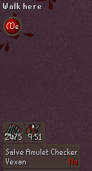
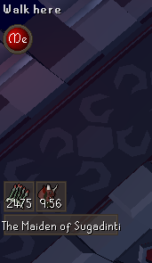

# SalveAmuletChecker
Checks which players do not have their Salve Amulet equip at Bloat Or Mystics.

## Settings
[Enable Salve Amulet Check in Cox](#enable-salve-amulet-check-in-cox)

[Enable Salve Amulet Check in Tob](#enable-salve-amulet-check-in-tob)

[Show Location in Chambers of Xeric](#show-location-in-chambers-of-xeric)

[Show Location in Theatre of Blood](#show-location-in-theatre-of-blood)

[Call out players](###call-out-players)

[Remove navigation button from side panel](###navigation-button-visible)

### Enable Salve Amulet Check in Cox
When checked an overlay will show up when you are in the mystic room displaying who yes/no if a player is wearing their salve amulet

### Enable Salve Amulet Check in Tob
When checked an overlay will show up when you are in the Bloat room displaying who yes/no if a player is wearing their salve amulet

### Show Location in Chambers of Xeric
A little overlay box will show up displaying the current room you are in.

### Show Location in Theatre of Blood
A little overlay box will show up displaying the current room you are in.

### Call out players
will call out players in the chat if they are not wearing their salve amulet in bloat & mystic room

### Navigation button visible
When unchecked will remove the Salve Amulet (e) icon from the Navigation side panel.